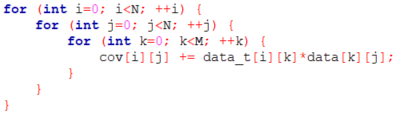
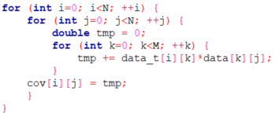

# Parallelized t-SNE for Dimensionality Reduction 

## Model Description: t-SNE
t-Distrubuted Stochastic Neighbor Embedding (t-SNE) is a popular dimensionality reduction technique for visualizing large, high-dimensional datasets in low-dimensional (usually 2) space [1]. The core idea of t-SNE is that each data point is assigned an ordered preference of a small number of other data points in which it will consider as neighbors. The original high-dimensional space is reduced to a low-dimensional embedded space, where the datapoints are mapped to preserve such neighborhood preference and order. The number of points that a data point considers as neighbors is known as perplexity, a concept derived from information theory and is typically passed in as a tunable parameter when utilizing the algorithm. In t-SNE, the probability of a neighborhood of each data point in the original high-dimensional space is a spherical Gaussian. In the embedded low-dimensional space, such probability is a Student t distribution with one degree of freedom, hence the “t” in t-SNE. With this approach, neighborhood relationships are preserved during embedding as opposed to absolute distances. Therefore, t-SNE generates aesthetically pleasing embedding plots and should not be used for clustering as embedded distances are often not meaningful.

Diving in more detail of the t-SNE algorithm, we start out with a vector of M data points, where each data point is a vector with N dimensions. In the original implementation of the t-SNE algorithm, principal component analysis (PCA) is used to preliminarily reduce the dimensionality of each data point by prioritizing dimensions (~50 dimensions) that capture the most variance between datapoints. After PCA, tSNE’s novelty begins, were the pairwise Euclidean distances between data points are calculated. Using the distances in this space, for each data point i, probabilities (p) of point i considering each point j as a neighbor are defined. To do this, a sigma value is fitted for each point i to achieve the global perplexity value that is passed in as a parameter. Conceptually, as sigma approaches zero, only the one closest neighbor is ever considered as a neighbor. Conversely, as sigma approaches infinity, the Gaussian becomes increasingly spread-out, allowing point i to consider more points j as neighbors. In the desired 2-dimensional space, the probabilities (q) of point i considering each point j as a neighbor is also defined. Given the two probability distributions p and q in different dimensional spaces, an objective function known as the Kullback-Leibler (KL) divergence is implemented to maximize the similarity between the p and q probability distributions. To minimize the KL loss function, numerical optimization techniques are used with the gradient information derived. It is of note that the global optimum is not guaranteed to be reached as the optimization is dependent on initial random initializations. In summary, given M data points in N dimensional space and a chosen perplexity, t-SNE maps the original M data points to a 2-dimensional t-SNE space. More details and the rationale of the algorithm can be found in the original paper published by Van der Maaten [1].

## Dataset and Application Description: t-SNE in Single-cell Transcriptomics and MNIST

The t-SNE algorithm is especially popular in the field of single-cell transcriptomics. DNA encodes the instructions to make all the machinery in human bodies. Depending on different stages of life or disease states, different cells carry out these instructions at different rates. This process is known as transcriptomics. In a typical workflow, cells are obtained from tissues, and ribonucleic acid (RNA) molecules are extracted. RNA expression levels are measured via genomic sequencing techniques and serve as biomarkers that capture a cell’s state and function at a particular timepoint [2]. Through understanding the RNA expression profile for each cell, how much the cells are carrying out these DNA instructions can be understood. These experiments result in a large gene expression matrix, where how much each cell has expressed a certain region of our genome is quantified. Typically, these large matrices are represented where the rows contain the genes (on the order of 30,000 for humans) and the columns contain cells (ranging from hundreds to tens of thousands depending on the experiment). Each value in the matrix can be thought of as counts. Each cell(M) is considered a data point in the dimensional space defined by the number of genes (N). Because of this large resultant matrix of RNA expression profiles, t-SNE is very beneficial to reduce the dimensionality and help visualize each individual cell in the embedded space. Here is an example of a visualization of different cell types in t-SNE space based on genomic expression profiles, where each axis represents a t-SNE reduced dimension [3]:

Initially in our application, we used a dataset where the RNA expression levels of pancreatic cells of healthy individuals and patients with type 2 diabetes are profiled [3]. The full dataset contained 3229 cells of various types with 27,539 genes profiled for RNA expression. When we applied our t-SNE implementation to this genomics dataset, we found that the algorithm was having difficulty converging despite tuning different parameters in our numerical optimization algorithm. We also attempted various normalization and subsetting techniques to the dataset to no avail. To prioritize parallelization implementation of the algorithm, we pivoted to the Modified National institute of Standards and Technology (MNIST) hand-written digit dataset, which when normalized to between 0 and 1 values, was known to converge with t-SNE algorithms (data/t10k-images.idx3-ubyte) [4]. The MNIST dataset here contains ten thousand images represented by pixel values (28 by 28) that create a hand-written digit between 0 and 9 when visualized in 2D. For t-SNE, the dataset is flattened into 2 dimensions, where each row represents a sample of a hand-written digit while each column prepresents the flattened pixel values of that image. The dataset is commonly used in computer vision and machine learning applications. Using the MNIST dataset has an additional benefit as it is often the benchmark dataset for measuring t-SNE algorithm performance in the literature. This allowed us to compare our C implementation to existing work. Because of the stochastic nature of t-SNE, we acknowledge that our gradient descent approach in our t-SNE algorithm may not be suitable for convergence of all datasets, especially those that are more complex and heterogeneous. While more complex numerical optimization algorithms was not pursued by the team, this is the logical next step for future work. To accomodate for different data file formats that may be of interest, we implemented different file parsers in the scripts that are pre-fixed with "read..." for users to utilize.

## C Implementation of t-SNE and the Need for Big Compute:
At its core, t-SNE involved a tremendous amount of matrix operations, especially given the size of matrices in applications that utilize t-SNE. In the PCA component of t-SNE, the numerical complexity of the sequential part grows by O(N squared), where N is the number of samples in the matrix while the parallel part grows by O(N cubed). The remainder of the t-SNE algorithm additionally grows by (X squared), where X is the number of values in the M by N (number of features) matrix. It is estimated that for a dataset size X of 25,000 data matrix values, a single core t-SNE run can take around 800 minutes [5]. Given matrices that can contain millions of values, a parallel implementation of t-SNE can significantly reduce computation time. In addition, currently, there is no C implementation of t-SNE that exists. We hypothesize that a successful parallel implementation of t-SNE in C would benefit the dimensionality reduction community, by providing customizable parallelizability in a compiler programming language with a multitude of parallelization infrastructures available. 

## Existing Work in Literature Further Drives Need for Big Compute
Python sklearn    
CUDA version (+plot), they only allowed for 2-D, we allow any-D    

## Platform, Application and Programming Model
AWS    
OpenACC    
Many-core, GPU accelerated computing    

## Code Profiling and Parallel Implementation
### t-SNE algorithm
explain some formulas/sections

### Code profiling    
We have profiled the execution time of the main sections of our code in order to identify the biggest bottlenecks. With this information we aimed to guide our parallelization efforts in a logical manner, focusing on the functions that take most of the execution time. 

The following table shows the percentage of time taken for each of the main sections of the code.

| Function | Time Taken (%) |
| --- | --- |
| PCA - subtract_col_means  |  0.09%  |
| PCA - Calculating Covariance Matrix  |  62.21%  |
| PCA - SVD - HouseHolders Reduction to Bidiagonal Form  |  4.34%  |
| PCA - SVD - Givens Reduction to Bidiagonal Form  |  1.66%  |
| PCA - SVD -Sort by Decreasing Singular Values  |  0.008%  |
| tSNE - calc_D  |  3.69%  |
| tSNE - calc_perplexity_diff  |  7.91%  |
| tSNE - calc_perplexity_diff while_loop a  |  0.52%  |
| tSNE - calc_perplexity_diff while_loop b  |  3.47%  |
| tSNE - calc_perplexity_diff while_loop c  |  0.018%  |
| tSNE - calc_sigmas total  |  12.14%  |
| tSNE - calc_pji  |  1.91%  |
| tSNE - Update P  |  1.65%  |

The main observation from the code profiling is that the PCA part takes about 70% of the time, much longer than the core t-SNE algorithm which only accounts for approximately 30% of the time. In the following section we define our main parallelization goals based on the results obtained in the code profiling. 

### Implementation Decisions
The PCA algorithm was our first target for parallelization for several reasons. The first and most obvious one is that PCA took most of the time. Additionally, if we look in more detail at the PCA profiling, we can see that the single function `Calculating Covariance Matrix` takes 62% of the total computational time. This function consists of a matrix multiplication of our data matrix with its transpose, which promised a big potential for being parallelizable using OpenACC. Another important advantage is that this function is only called once in the whole algorithm, which, as opposed to other functions in the core t-SNE part, further simplifies and increases the efficiency of its parallelization.

The other two functions that take a significant amount of time are the `Householders Reduction to Bidiagonal Form` (4.34%) and the `Givens Reduction to Bidiagonal Form` (1.66%), which are the two most important functions in the Singular Value Decomposition (SVD) step used to perform PCA. These two functions cannot be successfully parallelized because they have many data dependencies and complicated matrix update steps that are intrinsically serial. The parallelization of these functions would require creating additional code, which would add an unaffordable level of complexity and would probably introduce important overheads for small or medium matrices. Indeed, other authors have reported that parallelization improvements are only observed if they use matrices of really big dimensions [6], a lot bigger than what we would be using for our project. Taking this into consideration, and the fact that these two functions together only account for 6% of the serial total time, we have decided to focus on parallelizing the  function `Calculating Covariance Matrix`. 

TALK ABOUT TSNE PARALLELIZATION

The original implementation plan was to accelerate the PCA part using OpenACC due to its advantages for the matrix multiplication problem, and to use OpenMP in order to parallelize the core t-SNE section of the code. This approach was followed, but resulted in insignificant speedups for reasons that were not possible to determine. For this reason, and also because we were already using OpenACC in the PCA part, we chose to also use it to accelerate some sections of the core t-SNE part. 

MAYBE TALK ABIT MORE ABOUT OpenMP 

### Parallelization with OpenACC
**PCA section**

As mentioned earlier, the function `Calculating Covariance Matrix` takes 62% of the total time and it consists of an easily parallelizable matrix multiplication. The code for the matrix multiplication is shown below. We have three for loops and there are no dependencies, which will make the parallelization easier.

   

However, before proceeding with OpenACC, we changed the original code, which updated the covariance matrix (`cov`) directly in the inner for loop. We have, instead, introduced a temporal variable called `tmp` which is used to accumulate the sum in the inner loop and then `cov` is updated with the final result of the sum in `tmp`.  When adding the pragmas we will perform a loop reduction on `tmp`.

  

Regarding the acceleration of the matrix multiplication, we have added "pragma acc loop" statements in the two outer loops, and in the inner loop we are also performing a reduction (sum), on the variable `tmp`.  The "pragma acc kernels" at the beginning specifies how the data is moved in an out of the GPU from the CPU. This makes sure that it is not copied in and out every time and it is essential to avoid overheads associated with unnecessary data transfer steps.     

    

**Core t-SNE section**

For the parallelization of the t-SNE code, we chose to also use OpenACC which is suited to parallelizing t-SNE's many repetitive and identical matrix operations. Based on our initial profiling of the tsne code as well as from our understanding of the t-SNE algorithm, we identified calc_perplexity_diff() and calc_Q() as the two main bottlenecks in the code.

1. calc_perplexity() acceleration:

The pseudo code shown above describes the loop in which calc_perplexity() is being called. As seen, calc_perplexity_diff is repeatedly called to perform a rootfinding bisection search to find the sigma value that achieves the target perplexity. While one call of the function itself is quick (~0.004s) it can sometimes be called hundreds of thousands of times, resulting in long computation times. 

Using OpenACC, we parallelized this function with acc parallel directives for both of its for loops, in addition to a loop reduction as well as a specification for the vector_length or number of threads per block to be used. 

2. calc_Q() acceleration:

Similarly, calc_Q() is another function in t-SNE that is called a large number of times, specifically during each gradient descent iteration to calculate distances between points in the embedded 2D t-SNE space. Adding a parallel directive for the for loop as seen here allows all the GPU threads to perform independent distance calculations simultaneously. In addition to this, we specified the matrices to be copied in and out of the for loop, as well as adding a loop reduction for the running sum variable. 

## Reproducibility
### Python details    

anything we want to add here?

### AWS instance details    

In order to run the code we employed AWS Instances with GPU of the type `g3.4xlarge`. More detailed environment and replicability information can be found in [replicability.txt](replicability.txt).  

GPU instances are expensive, which is something that should also be taken into account when considering the adoption of accelerated code by a wide variety of scientists or end users. The product details about this instance are the following:

|  **Name**  | GPUs | vCPU | Memory (GiB) | **GPU Memory (GiB)** | **Price/hr\* (Linux)** | Price/hr* (Windows) | **1-yr Reserved Instance Effective Hourly\* (Linux)** | **3-yr Reserved Instance Effective Hourly\* (Linux)** |
| :--------: | :--: | :--: | :----------: | :------------------: | :--------------------: | :-----------------: | :---------------------------------------------------: | :---------------------------------------------------: |
| g3.4xlarge |  1   |  16  |     122      |          8           |         $1.14          |       $1.876        |                        $0.741                         |                        $0.538                         |

   

### Software Installation on AWS (Lab 5)

The document [Lab5_OpenACC_on_AWS.pdf](./AWS_OpenACC_guide/Lab5_OpenACC_on_AWS.pdf) file on folder [AWS_OpenACC_guide](./AWS_OpenACC_guide/) provides detailed information on how to setup an environment for GPU-accelerated computing using OpenACC on AWS instances.  This guide was used in the lab section 5 of the CS205 course at Harvard University.

### How to run t-SNE    

In order to compile the t-SNE algorithm on our data we have two options:

- Compile without acceleration:

  ``pgcc tsne.c -o tsne``     

- Compile with OpenACC acceleration:

  ``pgcc -acc -Minfo tsne.c -o tsne``     

The, we can run the compiled code just using: 

​		``./tsne``

## Performance evaluation
(speed-up, throughput, weak and strong scaling) and discussion about overheads and optimizations done.    

The speedup plots shown in the following sections were all computed comparing the baseline code execution time (without GPU acceleration) to the code run using OpenACC acceleration. We obtained runtime information about each of the main functions of the code, as detailed in the previous "Code Profiling" section, but we only calculate speedups for the higher-level sections "PCA", "Core t-SNE" and "Entire Code"  (PCA + Core t-SNE).

The code with and without acceleration were run 20 times each (40 in total), using a different matrix size/shape configurations in each step. We changed both the number or rows and columns:

- **Number of rows** (**M**) = corresponds to number of **samples** (e.g. number of pictures in MNIST data, number of cells from sc-RNAseq data), and are represented using lines with different colors. The values used for M are:
  - 100
  - 400
  - 1000
  - 4000
  - 8000
- **Number of columns** (**N**) = corresponds to number of **features** or variables (e.g. number of pixels in MNIST data, number of genes measured in sc-RNAseq data), and are represented in the horizontal axis. The values used for N are:
  - 100
  - 200
  - 400
  - 784 (max image size in MNIST)

The speedup plots generated as here described are shown below:

**PCA section speedup**

The speedup achieved in the PCA section were good, as we were expecting due to the ability of GPUs to accelerate matrix multiplications. The speedup curves showed a increasing trend with matrix size, both for M and N. This increase in performance seems to be especially higher when increasing N, which might be explained by the code having 2 outer for loops over N and only the inner loop is over M. With this reasoning, increasing N will increase the serial computational time more than if we increase M, which will leave more room for improvement from parallelization, and therefore more noticeable speedups. 

Additionally, it is worth noting that for very small matrices with small M and small N, GPU acceleration might not be needed since the parallelization overheads would be bigger than the gain in performance. This should be taken into account especially if we use cloud computing, since GPU-accelerated instances are significantly more expensive. 

In addition to changing M and N, as in the previous speedup plot, we also tried changing the vector length for OpenACC, as shown here:

We observe that the best performance is achieved when using vector size 32. For vector sizes that are too small or too big, the execution time increases because we are either not exploiting the parallelization enough, or because too much parallelization leads to having overheads that are greater than the increase in performance.

 

**Core t-SNE speedup**

Using the same dataset size benchmarks as those in our PCA speedup calculations, we calculated t-SNE's speedup as a function of dataset size, we can see that openACC worked quite well, achieving a maximum speedup of around 3.2 for our largest dataset. As expected, larger dataset sizes showed greater speedup, while smaller datasets such as those with 1000 or less samples were actually slower than baseline due to communication overheads, compounded with the time taken to copy data in and out of the GPU. 

**Total (PCA+t-SNE) speedup**

In terms of the speedup for the the entire code with both PCA and t-SNE sections combined, we saw a similar trend in speedup. The speedups seen were somewhere in between those reported in pca and those reported from tsne. We found the biggest speedup to be around 4 which was achieved with our biggest dataset (in terms of features and samples). 

**Total speedup comparing to Python sklearn**

## Goals Achieved and Future Work

In conclusion, we implemented a very complicated t-SNE algorithm in C from scratch that combines concepts from fields such as information theory, numerical optimization and high performance computing. With an implementation in a lower level programming language like C, we open the door to many parallelization and optimization possibilities for t-SNE. In terms of big compute parallelization, we were able to validate our design intentions and tackled areas of the algorithm that yielded the most fruitful speedups. While we achieved significant speedup compared to existing work, we also acknowledge some limitations in our implementation. First, the logical next step is to explore more complex optimization algorithms that converge a wider variety of more heterogeneous datasets. Such implementation would make our algorithm more versatile and flexible to datasets derived from different fields. In addition, there’s always more parallelization that can be done in our implementation that contains hundreds of lines of code. It would be interesting to explore other levels of parallelism with distributed-memory parallel processing or parallel data processing if there is a need to process large number of datasets. 

## References
1.	Van der Maaten, L., & Hinton, G. (2008). Visualizing data using t-SNE. Journal of machine learning research, 9(11).
2.	Kobak, D., & Berens, P. (2019). The art of using t-SNE for single-cell transcriptomics. Nature communications, 10(1), 5416. https://doi.org/10.1038/s41467-019-13056-x
3.	Segerstolpe Å, Palasantza A, Eliasson P, Andersson EM, Andréasson AC et al. (2016) Single-Cell Transcriptome Profiling of Human Pancreatic Islets in Health and Type 2 Diabetes. 
4.	"THE MNIST DATABASE of handwritten digits". Yann LeCun, Courant Institute, NYU Corinna Cortes, Google Labs, New York Christopher J.C. Burges, Microsoft Research, Redmond.
5.	Performance Comparison of Dimension Reduction Implementations¶. Performance Comparison of Dimension Reduction Implementations - umap 0.5 documentation. (n.d.). https://umap-learn.readthedocs.io/en/latest/benchmarking.html. 
6.	Wang, X. (2016). Using reconfigurable computing technology to accelerate matrix decomposition and applications.

