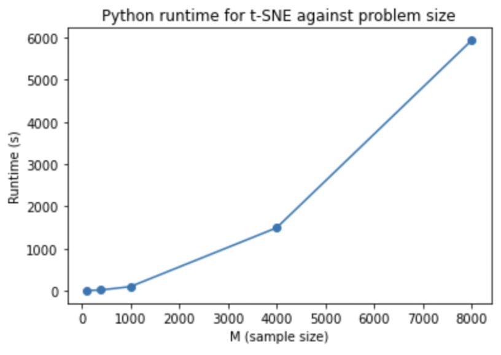
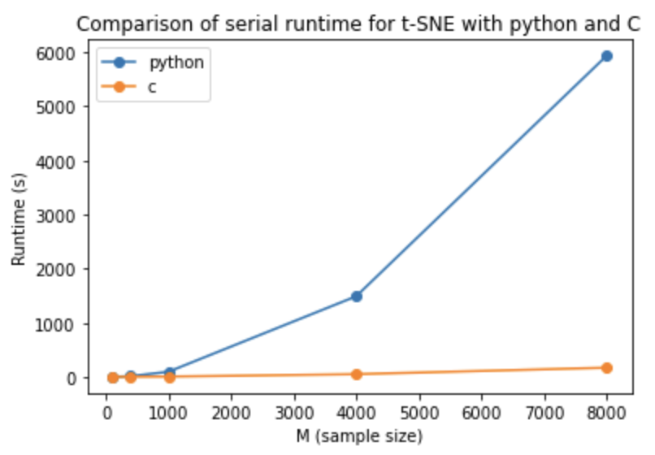

# Python implementation of t-SNE for Dimensionality Reduction 

This folder contain the code, results and reproducibility information for the python t-SNE implementation used as a comparison in our analysis

Folder structure:

	python_tsne.ipynb/
				contains the python t-SNE imlementation for MNIST dataset. 
				This code was adapted from the code for the MCB 112 course at Harvard. 
				The original code can be found here: http://mcb112.org/w13/w13-answers.html.

	execution_time.ipynb/ 
				contains the code for plotting the serial python and C t-SNE results for MNIST datasets of varying size

Parameters and data used for python execution:

	PCA: K=50 used for dimensionality reduction

	target_perplexity: 5.0

	Data: 
		MNIST dataset with pixes scaled to between 0 and 1 through division by 255
		Varying sample sizes, M (number of digits) were used with M=100,400,1000,4000 and 8000

Reproducibility:

	The code was run using python 3 on a MacBook Pro with 16GB memory. 
	All the packages needed execute the code are imported at the top of the script.
	
Results:

	The python serial times were:

	   
	
	The python serial times compares to C serial times were:
	
	   
	
